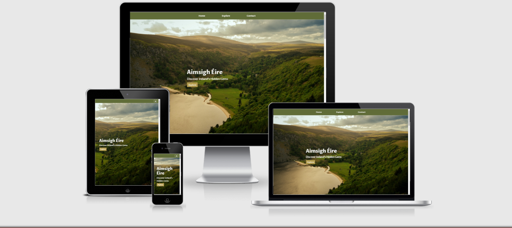

# Aimsigh Éire - Discover Ireland's Hidden Gems

This project aimed to help users find less-known tourist attractions within Ireland. 

[You can view the live project here](https://tomc2311.github.io/hidden-gems/)




## Overview

A website for people who wish to travel throughout Ireland, and visit some of the lesser-known landscapes and historic sites. 
The website is built as a single-page website that is responsive across all main devices; desktop, tablet, and mobile. 

The website features features an interactive map of Ireland that allows users to select different categories of tourist attractions, and see where they are located. 
The website also features a contact form that allows them to enquire about more information, and also submit attractions that have not yet been mentioned or implemented on the map. 

The main goal of this website is to promote traveling within Ireland and to give attention to some of the lesser-known tourist attractions. 

## User Stories

* I want a website that shows me lesser-known tourist attractions in Ireland. 
* I want a website that is easily accessed on my mobile phone and tablet. 
* I want a website that is easy to understand and navigate. 
* I want to be able to contact the site owner if I have any questions or suggestions. 
* I want to be able to filter the tourist attractions I am interested in. 
* I would like to be able to follow the website's social media accounts.
* I would like to be updated on any new features.


## Project Goals

* I want to promote travel within Ireland. 
* I want to highlight lesser-known landscapes and historic locations within Ireland. 
* I want to grow the website's social media presence. 
* I want users to understand and navigate the website upon their first visit. 
* I would like users to contact me with questions or suggestions. 


## UX 

In 2020/2021, domestic travel has increased, and this site aims to assist people in finding their next destination, particular destinations which are not very popular. 
The main attraction to the website is the interactive map, which allows users to pick and choose the type of attractions that they are interested in. 
The focus for the site is mainly natural landscape attractions, as many indoor activities have been suspended.
I also included some photos throughout the website which showcases the diverse attractions that a user can visit.

## Strategy 

The goal of this website is to highlight the many different attractions in Ireland, to promote domestic travel, and to show users the different kinds of attractions that they may be unaware of. 

The secondary goals of the website are to promote the website's social media following and allow for other users to submit other unknown attractions for future implementation via the contact form. So in the future, others can also experience these beautiful places. This allows for a sense of community, as well as continuous growth for the website.


### Business Goals: 

* Highlight and encourage travel to unknown attractions in Ireland. 
* A simple and easy to navigate website with a clear purpose.
* Mobile-first design to increase ease of use for those without PCs.
* Increase web-presence to grow the brand and popularity of domestic travel.


### User Goals: 

* Searching for next travel locations in Ireland. 
* Looking for ideas on what to visit when in Ireland. 
* Mobile-friendly website as the majority of users browses via mobile. 
* An easy-to-understand and navigate website. 
* A website that allows me to filter potential destinations. 
* To submit location ideas. 
* To contact the site owner for further questions. 
* To follow the website's social media accounts. 
* To sign up for future updates. 

## Scope 

The Scope and features of this project were based on personal experience throughout the last year. As international travel has become difficult and unpredictable due to the Covid-19 pandemic, I sought to find interesting tourist attractions in Ireland. 

Although there are many popular locations such as the famous 'Cliffs of Moher', many people look for other unknown things to do and see. This website aims to showcase the lesser-known attractions, and to give potential users an array of destinations for their next journey.

For this reason, the UX and UI are minimal with a heavy focus on the most important aspect of the website; the interactive map. 

## Structure 

I aimed to provide users with a simple and easy-to-navigate interface and experience. This is a one-page website, and as a result, when the users click on the navigation bar, it links them to the relevant sections of the website, rather than a new page. This keeps navigation simple, effective, and familiar. 

I have also opted to place the contact form beneath the interactive map, as it allows users to quickly submit a question or a location suggestion. 

As there are quite a lot of possible destinations, I picked three popular types to showcase beneath the home image, which aims to excite and intrigue users. These are placed before the map to build up the desire to travel within Ireland, showcasing beautiful images.

Within the map, users can click on location markers, and an info window populates with text and images related to the current location. 
I provided users with a very brief explanation of the location, as well as an image so they can see if this is something they would be interested in. I chose to keep the text brief, as I didn't want to take up to much of a user's time, or over-populate the screen with too much text. 

## Skeleton 

All wireframes were created using Balsamiq. As this is a one-page website, there were only slight design changes on PC, Desktop, and Mobile. The wireframes of each design are linked below. 

- Note: To open links in a new tab please use CTRL+click (on Windows and Linux) or CMD+click (on macOS).

### Wireframes     

* [Desktop](./docs/wireframes/wireframe-desktop.png)
* [Tablet](./docs/wireframes/wireframe-tablet.png)
* [Mobile](./docs/wireframes/wireframe-mobile.png)

## Surface 

### Images 

There are several images used throughout the site. I prioritized finding images that were the actual location of the marker locations. When the exact images of these locations were not available, I picked photos of location which shared similar characteristics. 

The two main images on the website; the home container image, and the footer container image, were chosen to showcase the large green and cliff landscapes that are spread throughout Ireland. I also opted to use images with green and subtle orange and yellow tones, to match the off-white background of the website. 

Also, I did not want the images to stand out too much, or provide too much contrast from one another. For this reason, the images with text above the map were selected for the similarity in green and blue tones. 


### Colours

The background-color for the website is #f1f1ef.

I chose this background-color as it allows the images to pop while keeping the background distraction-free. In aiming to have a simple and clean UI, the off-white background-color isn't distracting the user and keeps the focus on the content. 

Also, the off-white background allows the map to not feel out of place, as it compliments the colors in the google map; the blue ocean, and the off-white/yellow color of countries. 

I choose to use an off-white color for the jumbotron text, and the navbar text as it compliments the green background. The white text also catches the user's attention and feels inviting. 

I choose to use a green-background on the navigation bar(#606c38). I wanted to add some color to the website, while also keeping it to a minimum. A dark green navigation bar complements the green images and the overall theme of the website. 

For the buttons, I chose to use the color: #b39c4d. This is a dark yellow/gold color, which compliements the green and blue tones from the images, as well as the naivgation bar. 

In regards to the map buttons, I decided to use a different background color when the button is clicked or hovered. I used the same shade of grey that is used in the Google Maps button. This helps to add consistency in this section of the website. 

### Font 

I decided to use two fonts for this project. I chose the font 'Proza Libre' for the navigation links, footer links, and all headings. I felt this font had a lot of Celtic character and it complimented the tone and essence of the website. 

For the body, I chose to use the font 'Open Sans'. I decided to use this font as it paired well with Proza Libre. I felt this font was not distracting, and quite conventional. This was especially important because Proza Libre is a little less conventional.


## FEATURES


### Current Features 

The main feature of this website is the interactive google map. I chose to only show one type of attraction at a time, to prevent the map from being too cluttered. This also allows the users to specifically chose what they're interested in discovering. 

The rest of the website is intentionally simple and designed to either motivate users to discover new locations via the map, or to encourage users to submit their secret locations via the contact form. 

I added an info window on each marker which displays some information about the location as well as an image. This allows the user to get an idea of the location, to see if it is something they would be interested in visiting. 

In regards to the type of locations, I choose destinations that were mainly located outside. This was a choice influenced by the current covid-19 restrictions. 

I have also added a 404.html page to re-direct users to the home page, if a 404 error occurs. This creates a better experience for all users, so they do not have to use the browser to navigate. 

### Future Features 

In the future, I would like to add the option for a user to get directions to the landmark of their choice from their current destination. 

I would also like to filter all locations by region, so if a user is planning a round trip around a certain area, then all locations will be available to them. 


## Troubleshooting 


1. One of the biggest issues I faced when implementing the google maps API was an occurring error in the console. The error was related to an uncaught promise and stated that "initMap is not a function". This error would show occasionally, and the map would not load. I hadn't noticed the issue as sometimes the map would load, and other times it wouldn't. 

	Upon investigating the issue, it seemed that because the google maps API was loading before the map.js file, the browser could not locate the function which was referenced in the google map API script. 

	The solution for this was to load my map.js before the Google Maps API. This removed the error, as the initMap function was present when the google maps API was called. 


2. The interactive map initially had different icons for each type of attraction (beach flags to represent beaches, castle icons to represent the castle locations, etc). However, as there are a lot of markers, the map quickly began cluttered and difficult to use. I felt this design overwhelmed the user. 

	I then chose to only show one type of location at a time and added an event listener to each button to only show markers that corresponded to that button. This reduced the number of markers that were shown at once and also allowed the users to focus on one type of attraction at a time. 


3. When I was creating the map, the initial map was just a set of markers (for cliffs and mountain locations). However, I had an issue when I wanted to create a second array of markers that corresponded to a button. Once clicked, the previous markers would vanish, and the new relevant ones would appear. 

	I was unable to populate the map with the new markers, and I thought I would have to create a new map function for the different types of tourist attractions. This would be less than ideal as I planned to have at least five different types of locations. However, I decided to pass a parameter into the original function, and create an if statement using the same parameter. 

	I then created buttons and created an on-click function that would call the function with the specific locations as the parameter. This allowed me to keep one main function and allows the possibility for many new types of locations to be added with ease. 


4. I ran into an issue of removing and adding classes depending on which button was clicked. While I could target one button to add and remove class, with each subsequent click, only the last button's class was removed. At first, this wasn't noticeable however, when I added more buttons, the map markers for some buttons would populate despite not being clicked. A solution to this issue was found on StackOverflow. 


5. I had an issue with the navigation bar specifically when using the hover effect. I wanted a border-bottom when hovered, however, there was quite a bit of jumping, and the navigation bar would grow and shrink when the hover effect was executed by the user. 
	
	This was solved by adding a transparent bottom border to the navigation bar, and when the user hovered on the items, to change the color of the border. This removed the jumping in size. 


6. I wanted to remove the different styles of map types and just wanted to show the road map style for this website. I was unsure how to do this and first began trying to disable the button completely. However, upon reading Google Maps API Documentation, I found that if you specify the mapTypeId then the others are automatically hidden. The reference for this code is also documented in the reference section of this README. 


7. I had an issue when trying to customize the map's info window. When a user clicks a marker, the info window would pop up with the relevant information. However, when a user clicks another marker, a second info window would pop up, and the previous window would remain. This quickly polluted the screen space. An event listener was created to close the previous info window. The code for this is credited in the reference section of the README file. 


8. Another issue I ran into when customizing the map's info window was crying to style the headings and text within the info window. The default layout was a wide pop-up container that covered 70% of the map. As I wanted to place an image inside of each info window, the container grew more, to a point where it covered most of the map.

	There is a section on the Google Maps API Documentation which demonstrates how to edit the text content of the info window. I decided to try and add classes to the info window's content, and style them in CSS. This worked and allowed me to not only change the default layout of the info windows but also the text, image, and headings. This allowed me to achieve an info window that was much smaller and concise, which didn't clutter the screen space. 


9. I was having an issue with centering the modal title. When I would center the heading, it would also push the close icon further to the left, and ultimately outside the modal. I tried adjusting the close icon with CSS padding and margin, but it was not responsive on mobile or smaller devices. 
	
	Upon searching stack overflow, I found that you can add the class 'w-100' to the title, which centers the title while maintaining the correct position for the close icon. 

	This can be seen [here](https://stackoverflow.com/questions/42121897/boostrap-v4-0-0-alpha-6-model-how-to-center-model-title)


10. I experienced an issue with the contact form as I wanted to display a thank you message to users when they submit the contact form. At first, I created an alert that executed when the email was successful. However, I felt this was intrusive to the user, and upon reading the jQuery documentation I discovered the .show() effect. This allowed me to created a div and set its display to none. 
	Using the .show() effect, I could display the message when the user sends their email. 
	Another issue with this was that it would take the message a couple of seconds to display, but reading the documentation I discovered by passing through the parameter "fast", the message displayed much quicker

11. I experienced an issue with text and image alignment in the section with features three images, and text beside each image. The issue would occur at medium screens, where the image would shrink, while the text would remain the same. This resulted in a drastic layout change, which disrupted the flow of content and created a messy layout. 
	The fix for this was to change the font size on medium screens to keep the alignment correct. This was achieved with a media query by using the logical operator 'and combining a min-width and max-width media query. This was discovered on MDN's CSS documentation.

12. I encountered an issue regarding background images on mobile devices, specifically with Safari. All background images would be zoomed, and difficult to see. The issue is related to the parallax feature of the background images. The world around for this is to add a media-query for smaller devices, and disable the parallax feature. 
    As I had more than one container with this feature, I added a the class 'parallax' to both containers, and used a media query for this class. This allowed me to avoid using repeated code. 
    The code used is below:
```
 @media screen and (max-width: 992px) {
    .parallax {
        background-attachment: scroll;
    }
}
```

## Technologies Used


* This website was initially designed with wireframes using [Balsamiq](https://balsamiq.com/). 
* This website was developed using [HTML5](https://en.wikipedia.org/wiki/HTML5), [CSS3](https://en.wikipedia.org/wiki/CSS) and [JavaScript](https://en.wikipedia.org/wiki/JavaScript) 
* [Bootstrap](https://getbootstrap.com/) was used to structure the layout of the website and maintaining layout and responsiveness to tablet and mobile devices. I linked Bootstrap to the HTML document via [CDN](https://www.bootstrapcdn.com/).
* I used [Font Awesome](https://fontawesome.com/) for several icons, including the hamburger icon in the navigation bar for smaller devices. All social media icons in the footer are also from Font Awesome. 
* The fonts used in this website were imported from [Google Fonts](https://fonts.google.com/). 
* [Git](https://git-scm.com/) version control was used to store the version of files and track the development progress. 
* The IDE used to work on this project was [Gitpod](https://www.gitpod.io/). 
* [Github](https://github.com/) was used to manage Git repositories.
* Github Pages was used to deploy the website. 
* HTML code was validated with [W3C](https://validator.w3.org/). 
* [W3C CSS](https://jigsaw.w3.org/css-validator/) was used to check the validity of the CSS code in this project. 
* [Jshint](https://jshint.com/) was used to test the validity of JavaScript code. 
* [Google Lighthouse](https://developers.google.com/web/tools/lighthouse#devtools) was used to check that the website is user-friendly.
* [Google Mobile-Friendly Test](https://search.google.com/test/mobile-friendly) to test the website on mobiles. 
* [Favicon.io](https://favicon.io/) was used for the website's favicon.
* [MDN CSS](https://developer.mozilla.org/en-US/docs/Web/CSS) was used to further understand media queries.


## Testing

The documentation for testing this website is located in another file. This can be viewed [here](./docs/testing/testing.md). 

Note: To open links in a new tab, please use CTRL+click (on Windows and Linux) or CMD+click (on macOS).


## Deployment

1. I first opened Gitpod to confirm that my branch was up to date and my working tree was clean. 
2. I then opened my internet browser and searched for GitHub. I logged into my Github account. 
3. I clicked on my project titled 'hidden gems'. 
4. After opening my project, I clicked on the 'settings' option. 
5. Within the settings options, I scrolled to the section titled 'GitHub Pages'. 
6. In the section 'GitHub Pages', there is an option 'Source', I selected the master branch, and clicked 'Save'. 
7. I refreshed my page, and the GitHub Pages link appeared under the 'GitHub Pages' section on the Settings Page. 
8. It can take a few minutes for the website to be activated. 
9. After waiting a couple of minutes, I clicked on the generated link. 
10. The website had successfully deployed. 


## Credits 

### Images 

All photos were obtained from [Unsplash](https://unsplash.com/)

### Text 

I wanted the locations to be as accurate as possible could make them, so I spent some time researching a variety of locations throughout Ireland. As a result, there is some text which was referenced from a location's Wikipedia page. This is documented here:

For the castle locations, information for Leap Castle and Trim Castle was taken from their respective Wikipedia pages: 

[Leap Castle](https://en.wikipedia.org/wiki/Leap_Castle)

[Trim Castle](https://en.wikipedia.org/wiki/Trim_Castle)

For the cave locations, I researched the caves from the following websites:

[Caves of Kesh](https://en.wikipedia.org/wiki/Caves_of_Kesh)

[Dunmore Cave](https://en.wikipedia.org/wiki/Dunmore_Cave)

[Marble Arch Caves](https://en.wikipedia.org/wiki/Marble_Arch_Caves)

[Doolin Cave](https://en.wikipedia.org/wiki/Doolin_Cave)

[Aillwee Cave](https://en.wikipedia.org/wiki/Aillwee_Cave)

[Pollnagollum](https://en.wikipedia.org/wiki/Pollnagollum)

[Bruces Cave](https://www.familyfun.ie/bruces-cave/)

[Crag Cave](https://www.cragcave.com/)


Wild Camping locations in Ireland are naturally, a well-kept secret. I credit the following websites for curating some of the camping locations: 

[Wild camping spots](https://outsider.ie/ireland/wild-camping-ireland/)

[Unknown camping spots](https://www.osi.ie/blog/irelands-best-wild-camping-spots/)

I also curated some locations from the list from the following articles: 

[Lesser known Castles](https://www.theirishstore.com/blog/lesser-known-castles-ireland/)

[Irishroadtrips.ie](https://www.theirishroadtrip.com/best-places-to-visit-in-ireland/)

[Outsider.ie](https://outsider.ie/ireland/best-beaches-ireland/)

[Hidden Ruins in Ireland](https://studyireland.ie/2017/04/18/top-10-hidden-ruins-in-ireland/)


## References for Code

* Code to help with targeting map-active button to remove and add a class on click. This can be seen [here](https://stackoverflow.com/questions/41476916/jquery-make-pressed-button-active-and-all-other-buttons-inactive)

* The background image opacity and jumbotron code was referenced from Code Institute Whiskey Drop Project. 

* Inspiration for the README file was taken from Code Institute README template. This can be seen [here](https://github.com/Code-Institute-Solutions/SampleREADME) 

* For the input fields, instead of using the default blue glow, I changed it to a black border outline via CSS. This can be seen [here](https://stackoverflow.com/questions/14820952/change-bootstrap-input-focus-blue-glow)

* Documentation where I found how to set Map Types, can be seen [here](https://developers.google.com/maps/documentation/javascript/maptypes) 

* Documentation where I based editing the infoWindow content from can be seen [here](https://developers.google.com/maps/documentation/javascript/infowindows) 

* Code to center the modal title can be seen [here](https://stackoverflow.com/questions/42121897/boostrap-v4-0-0-alpha-6-model-how-to-center-model-title)

* Code for removing previous info window can be seen [here](https://groups.google.com/g/google-maps-js-api-v3/c/cA2VRg4TO1k?pli=1) 

	this particular code: 
	
		var currentInfoWindow = null;
		var infowindow = new google.maps.InfoWindow({
		content: "your content here"
		});
		google.maps.event.addListener(marker, 'click', function() {
		if (currentInfoWindow != null) {
		currentInfoWindow.close();
		}
		infowindow.open(map, marker);
		currentInfoWindow = infowindow;
		});


* Code where I used the jQuery animation .show() can be seen [here](https://api.jquery.com/show/)

* Code to understand combining media queries was found on [MDN](https://developer.mozilla.org/en-US/docs/Web/CSS/Media_Queries/Using_media_queries)

* Code to create the EmailJS function and understanding of the EmailJS API was referenced from Code Institute's lesson titled 'Putting it all together, Sending Emails Using EmailJS'

* Code to help implement the Google Maps API was from Code Institute's lesson titled 'Putting it all together, Google Maps'. 
* Code to help in implenting the Google Maps API was also from the official documentation. This can be seen [here](https://developers.google.com/maps/documentation/javascript/overview)


## Acknowledgements


* I would like to thank my mentor Aaron Sinnott for his continuous support and feedback. 
* I would like to thank the Tutor support at Code Institute for their support and patience.
* I would like to thank the Code Institute Slack community for assistance and support in understanding JavaScript. 